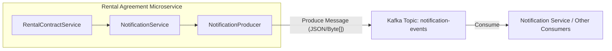

# Rental Agreement Microservice

## Role of the Microservice

The **Rental Agreement Microservice** is a core component of the RealEstate Rental Project. It is responsible for managing the lifecycle of rental contracts and agreements between property owners and tenants.

### Key Responsibilities:
- **Contract Management**: Creation, updating, and tracking the state of rental contracts (e.g., `PENDING_RESERVATION`, `ACTIVE`, `DISPUTED`).
- **Payment Handling**: Tracking initial payments and rent disbursements related to contracts.
- **Key Delivery**: Managing the formal confirmation of key delivery by tenants.
- **Notification Triggering**: Monitoring contract-related events and initiating notifications for relevant parties via Kafka.
- **Dispute Resolution Tracking**: Integration with dispute services to handle and record contract conflicts.

## Kafka Integration

This microservice acts as a **Producer** for notification events. When significant actions occur within the service (like a contract being created or keys being delivered), it publishes messages to a dedicated Kafka topic.

### Producer Architecture

The service sends `NotificationEvent` objects to the `notification-events` topic.

### Kafka Configuration Details:
- **Topic Name**: `notification-events`
- **Key Serializer**: `StringSerializer`
- **Value Serializer**: `ByteArraySerializer` (JSON serialized byte array)
- **Producer Factory**: Configured with bootstrap servers and standard Kafka producer properties.

## Tech Stack
- **Framework**: Spring Boot 3
- **Messaging**: Apache Kafka
- **Database**: PostgreSQL/MySQL (via Spring Data JPA)
- **Communication**: OpenFeign (for inter-service calls to Property Service, etc.)
- **Resilience**: Resilience4j (Circuit Breaker)
- **Security**: Spring Security with JWT

## API Endpoints
- `/api/contracts`: Manage rental agreements and key delivery statuses.
- `/api/payments`: View and track payment reports.
- `/api/scoring`: AI-based tenant scoring logic.
