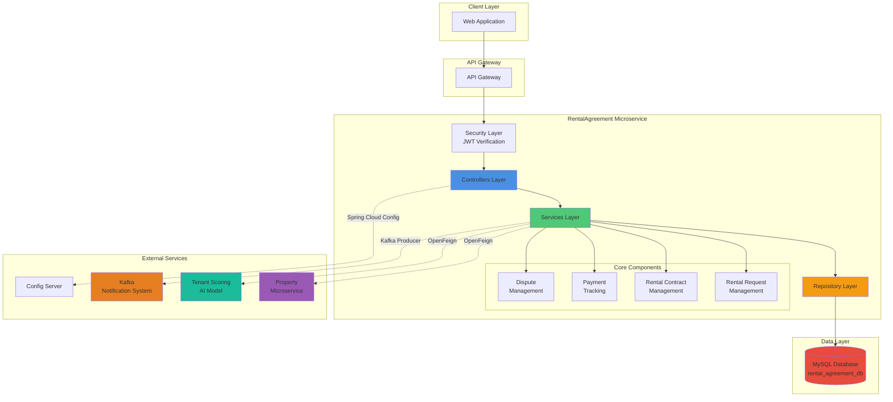
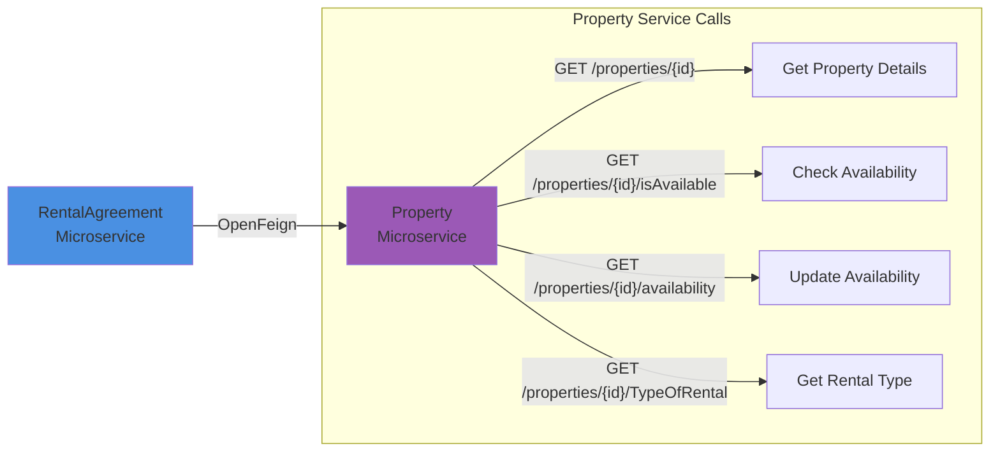
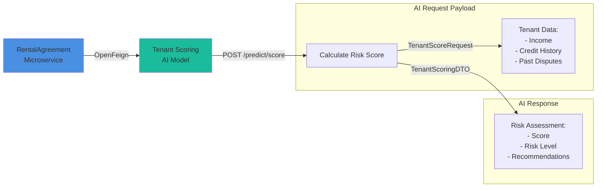
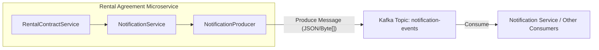

# Rental Agreement Microservice


## 📋 Table of Contents

- [Overview](#-overview)
- [Architecture](#-architecture)
- [Key Features](#-key-features)
- [Technology Stack](#-technology-stack)
- [Core Components](#-core-components)
- [API Endpoints](#-api-endpoints)
- [Inter-Service Communication](#-inter-service-communication)
- [Database Schema](#-database-schema)
- [Configuration](#-configuration)
- [Getting Started](#-getting-started)
- [Deployment](#-deployment)
- [Security](#-security)

---

## 🎯 Overview

The **Rental Agreement Microservice** is a central component of a distributed real estate rental platform. It orchestrates the complete rental lifecycle from initial tenant requests to contract management, payment tracking, and dispute resolution. This microservice integrates seamlessly with other platform services including Property Management, Tenant Scoring AI, and Notification systems.

### Business Context

This microservice operates within a real estate ecosystem where:
- **Tenants** browse properties and submit rental requests
- **Landlords** review applicants and approve/reject requests
- **Smart Contracts** handle secure blockchain-based payments
- **AI Models** assess tenant risk and credibility
- **Notifications** keep all parties informed throughout the process

---

## 🏗 Architecture

### High-Level System Architecture



---

## ✨ Key Features

### 🔹 Rental Request Management
- **Tenant Request Submission**: Tenants can submit rental requests for available properties
- **Landlord Review**: Landlords can view, approve, or reject rental requests
- **AI-Powered Screening**: Integration with Tenant Scoring AI to assess applicant risk
- **Automatic Status Management**: System automatically rejects competing requests when one is accepted
- **Property Availability Sync**: Real-time synchronization with Property Microservice

### 🔹 Rental Contract Management
- **Smart Contract Integration**: Blockchain-based contract creation with escrow payments
- **Multi-State Lifecycle**: Tracks contracts through PENDING_RESERVATION, ACTIVE, EXPIRED, and TERMINATED states
- **Key Delivery Confirmation**: Tenant confirms physical key receipt to activate the contract
- **Flexible Rental Terms**: Supports DAILY and MONTHLY rental periods
- **Automatic Calculation**: Computes total rental amounts based on dates and rental type

### 🔹 Payment Tracking
- **Blockchain Integration**: Records all payments from Ethereum smart contract events
- **Transaction Verification**: Each payment includes unique transaction hash (txHash) for audit trail
- **Payment History**: Complete payment history per rental contract
- **Status Tracking**: Monitors payment status (COMPLETED, PENDING, FAILED)
- **Escrow Management**: Handles initial security deposits and ongoing rent payments

### 🔹 Dispute Management
- **Dispute Tracking**: Records and tracks all tenant-landlord disputes
- **Historical Data**: Maintains dispute summaries per tenant for AI model training
- **Contract Termination**: Can terminate contracts based on dispute outcomes
- **Metrics Collection**: Provides dispute data for risk assessment and platform improvements

### 🔹 Event-Driven Notifications
- **Kafka Integration**: Publishes events to notification system for all major lifecycle events
- **Multi-Channel Support**: Supports EMAIL, SMS, and IN_APP notification channels
- **Event Types**: REQUEST_SUBMITTED, REQUEST_ACCEPTED, CONTRACT_CREATED, PAYMENT_RECEIVED, DISPUTE_FILED, etc.
- **Real-time Updates**: Keeps tenants and landlords informed throughout the process

---

## 🛠 Technology Stack

### Core Framework
- **Java 17**: Modern LTS version with latest language features
- **Spring Boot 3.4.1**: Latest Spring Boot framework for microservices
- **Spring Cloud 2024.0.0**: Cloud-native patterns and distributed system support

### Data & Persistence
- **Spring Data JPA**: Simplified data access with JPA/Hibernate
- **MySQL**: Production-ready relational database
- **H2 Database**: In-memory database for development and testing
- **Flyway/Liquibase**: Database version control (configured via external config)

### Communication & Integration
- **Spring Cloud OpenFeign**: Declarative REST client for inter-service communication
- **Apache Kafka**: Event streaming platform for asynchronous messaging
- **Spring Cloud Config**: Centralized configuration management

### Security
- **Spring Security**: Comprehensive security framework
- **JWT (jjwt 0.12.5)**: JSON Web Token for stateless authentication
- **Role-Based Access Control**: Fine-grained authorization (TENANT, LANDLORD, ADMIN)

### Development Tools
- **Lombok 1.18.30**: Reduces boilerplate code with annotations
- **MapStruct 1.5.5**: Type-safe bean mapping
- **Spring Boot DevTools**: Hot reload and enhanced development experience
- **Spring Boot Actuator**: Production-ready monitoring and management

### DevOps & Deployment
- **Docker**: Containerization with Alpine-based JRE image
- **Jenkins**: CI/CD pipeline automation (Jenkinsfile included)
- **Maven**: Dependency management and build automation

---

## 🧩 Core Components

### 📂 Package Structure

```
com.lsiproject.app.rentalagreementmicroservicev2
├── configuration/          # Application configuration classes
│   ├── FeignConfig.java   # OpenFeign client configuration
│   └── KafkaProducerConfig.java  # Kafka producer setup
│
├── controllers/            # REST API endpoints
│   ├── RentalRequestController.java
│   ├── RentalContractController.java
│   ├── PaymentController.java
│   ├── DisputeSummaryController.java
│   ├── ReportController.java
│   └── AiModelsController.java
│
├── services/               # Business logic layer
│   ├── RentalRequestService.java
│   ├── RentalContractService.java
│   ├── PaymentService.java
│   ├── PaymentReportService.java
│   ├── DisputeSummaryService.java
│   ├── NotificationService.java
│   └── TenantScoringAiModelService.java
│
├── repositories/           # Data access layer
│   ├── RentalRequestRepository.java
│   ├── RentalContractRepository.java
│   ├── PaymentRepository.java
│   ├── PaymentReportRepository.java
│   └── DisputeSummaryRepository.java
│
├── entities/               # JPA entities
│   ├── RentalRequest.java
│   ├── RentalContract.java
│   ├── Payment.java
│   ├── PaymentReport.java
│   └── DisputeSummary.java
│
├── dtos/                   # Data Transfer Objects
│   ├── RentalRequestDto.java
│   ├── RentalRequestCreationDto.java
│   ├── RentalContractDto.java
│   ├── PaymentDto.java
│   ├── NotificationEvent.java
│   └── ...
│
├── mappers/                # MapStruct mappers
│   ├── RentalRequestMapper.java
│   ├── RentalContractMapper.java
│   └── PaymentMapper.java
│
├── openFeignClients/       # External service clients
│   ├── PropertyMicroService.java
│   └── TenantScoringAiModel.java
│
├── kafka/                  # Kafka producers/consumers
│   └── NotificationProducer.java
│
├── security/               # Security components
│   ├── JwtAuthFilter.java
│   └── JwtUtil.java
│
├── enums/                  # Enumeration types
│   ├── RentalRequestStatus.java
│   ├── RentalContractState.java
│   ├── PaymentStatus.java
│   ├── EventType.java
│   └── Channel.java
│
└── exceptions/             # Exception handling
    └── GlobalExceptionHandler.java
```

### 🗄️ Core Entities

#### RentalRequest
Represents a tenant's initial request to rent a property.

**Key Fields:**
- `idRequest`: Unique identifier
- `tenantId`: ID of the requesting tenant (from Auth microservice)
- `propertyId`: ID of the desired property (from Property microservice)
- `status`: PENDING, ACCEPTED, REJECTED, EXPIRED
- `createdAt`: Timestamp of request creation

#### RentalContract
Represents the formal rental agreement between landlord and tenant.

**Key Fields:**
- `idContract`: Unique identifier
- `agreementIdOnChain`: Corresponding blockchain contract ID
- `ownerId`: Property owner ID
- `tenantId`: Tenant ID
- `propertyId`: Property ID
- `rentAmount`: Monthly/daily rent amount
- `securityDeposit`: Initial deposit amount
- `startDate` / `endDate`: Contract duration
- `state`: PENDING_RESERVATION, ACTIVE, EXPIRED, TERMINATED
- `isKeyDelivered`: Key receipt confirmation
- `isPaymentReleased`: Initial payment release status

#### Payment
Tracks all rental payments from blockchain transactions.

**Key Fields:**
- `idPayment`: Unique identifier
- `rentalContract`: Associated contract (ManyToOne relationship)
- `amount`: Payment amount
- `txHash`: Ethereum transaction hash (unique)
- `status`: COMPLETED, PENDING, FAILED
- `timestamp`: Blockchain block timestamp
- `tenantId`: Payer ID

#### DisputeSummary
Records dispute history for tenant risk assessment.

**Key Fields:**
- `id`: Unique identifier
- `tenantId`: Tenant involved in dispute
- `ownerId`: Owner involved in dispute
- `totalDisputes`: Count of disputes
- `lastDisputeDate`: Most recent dispute timestamp

---

## 🌐 API Endpoints

### Rental Requests

| Method | Endpoint | Description |
|--------|----------|-------------|
| `POST` | `/api/rentalAgreement-microservice/rental-requests` | Create new rental request |
| `GET` | `/api/rentalAgreement-microservice/rental-requests` | Get all requests |
| `GET` | `/api/rentalAgreement-microservice/rental-requests/{id}` | Get request by ID |
| `GET` | `/api/rentalAgreement-microservice/rental-requests/property/{propertyId}` | Get requests for property |
| `GET` | `/api/rentalAgreement-microservice/rental-requests/tenant/{tenantId}` | Get requests by tenant |
| `PUT` | `/api/rentalAgreement-microservice/rental-requests/{id}/status` | Update request status |
| `DELETE` | `/api/rentalAgreement-microservice/rental-requests/{id}` | Delete request |

### Rental Contracts

| Method | Endpoint | Description |
|--------|----------|-------------|
| `POST` | `/api/rentalAgreement-microservice/rental-contracts` | Create new contract |
| `GET` | `/api/rentalAgreement-microservice/rental-contracts/{id}` | Get contract by ID |
| `GET` | `/api/rentalAgreement-microservice/rental-contracts/user/me` | Get user's contracts |
| `PUT` | `/api/rentalAgreement-microservice/rental-contracts/{id}/key-delivery` | Confirm key delivery |
| `PUT` | `/api/rentalAgreement-microservice/rental-contracts/{id}/dispute` | Terminate by dispute |

### Payments

| Method | Endpoint | Description |
|--------|----------|-------------|
| `POST` | `/api/rentalAgreement-microservice/payments` | Record payment (blockchain listener) |
| `GET` | `/api/rentalAgreement-microservice/payments/{id}` | Get payment by ID |
| `GET` | `/api/rentalAgreement-microservice/payments/contract/{contractId}` | Get payment history |

### Disputes

| Method | Endpoint | Description |
|--------|----------|-------------|
| `POST` | `/api/disputes` | Create dispute record |
| `GET` | `/api/disputes` | Get all disputes |

---

## 🔗 Inter-Service Communication

### Integration with Property Microservice



**Purpose**: Validates property availability and synchronizes rental status.

**OpenFeign Client**: `PropertyMicroService.java`

**Configuration**: URL configured via `property.service.url` property

### Integration with Tenant Scoring AI Model



**Purpose**: Assesses tenant credibility using machine learning models.

**OpenFeign Client**: `TenantScoringAiModel.java`

**Configuration**: URL configured via `tenantScoringAiModel.service.url` property

### Kafka Event Publishing

The service sends `NotificationEvent` objects to the `notification-events` topic.



**Purpose**: Asynchronous event-driven notifications to users.

**Producer**: `NotificationProducer.java`

**Event DTO**: `NotificationEvent.java` (serialized to byte array)

---


## Database Configuration

**Production**: MySQL Database
- Database name: `rental_agreement_db` (configured via Spring Cloud Config)
- Character set: UTF-8
- Timezone: UTC

**Development**: H2 In-Memory Database
- Console: `/h2-console`
- Auto-initialization with schema

---

## ⚙️ Configuration


### External Configuration (via Config Server)

The following properties are managed by **Spring Cloud Config Server** (port 8888):

- **Database Configuration**: JDBC URL, credentials, JPA settings
- **Kafka Configuration**: Bootstrap servers, topics, serializers
- **Feign Client URLs**: Property service and AI model endpoints
- **JWT Secret**: Token signing key
- **Logging Levels**: Application-specific log configurations

---

## 🚀 Getting Started

### Prerequisites

- **Java 17** or higher
- **Maven 3.6+**
- **MySQL 8.0+** (for production)
- **Docker** (optional, for containerized deployment)
- **Kafka** (if running locally)
- **Config Server** (running on port 8888)

### Local Development Setup

1. **Clone the repository**
   ```bash
   git clone <repository-url>
   cd RentalAgreement-microserviceV2
   ```

2. **Start Config Server**
   Ensure your Spring Cloud Config Server is running on `http://localhost:8888`

3. **Configure external services**
   Update your Config Server with:
   ```yaml
   property:
     service:
       url: http://localhost:8082  # Property Microservice
   
   tenantScoringAiModel:
     service:
       url: http://localhost:5000  # AI Model Service
   
   spring:
     kafka:
       bootstrap-servers: localhost:9092
   ```

4. **Run with Maven**
   ```bash
   ./mvnw spring-boot:run
   ```

5. **Access the application**
   - API Base URL: `http://localhost:8083`
   - Actuator Health: `http://localhost:8083/actuator/health`
   - H2 Console (dev): `http://localhost:8083/h2-console`

### Building for Production

```bash
./mvnw clean package -DskipTests
```

The JAR file will be created in `target/RentalAgreement-microservice-0.0.1-SNAPSHOT.jar`

---

## 🐳 Deployment

### Docker Deployment

**Build Docker Image**
```bash
docker build -t rentalagreement-microservice:latest .
```

**Run Container**
```bash
docker run -p 8083:8083 \
  -e SPRING_PROFILES_ACTIVE=prod \
  -e SPRING_CLOUD_CONFIG_URI=http://config-server:8888 \
  rentalagreement-microservice:latest
```

### Docker Compose Example

```yaml
version: '3.8'
services:
  rentalagreement:
    image: rentalagreement-microservice:latest
    ports:
      - "8083:8083"
    environment:
      - SPRING_PROFILES_ACTIVE=prod
      - SPRING_CLOUD_CONFIG_URI=http://config-server:8888
    depends_on:
      - mysql
      - kafka
      - config-server
    networks:
      - rental-network

  mysql:
    image: mysql:8.0
    environment:
      MYSQL_DATABASE: rental_agreement_db
      MYSQL_ROOT_PASSWORD: root
    ports:
      - "3306:3306"
    networks:
      - rental-network

networks:
  rental-network:
    driver: bridge
```

### Jenkins CI/CD

The repository includes a `Jenkinsfile` for automated build and deployment pipelines.

---

## 🔐 Security

### Authentication & Authorization

- **JWT-based Authentication**: Stateless token-based security
- **Spring Security**: Comprehensive security framework
- **Role-Based Access Control**:
  - `ROLE_TENANT`: Can create requests, view own contracts
  - `ROLE_LANDLORD`: Can approve/reject requests, manage properties
  - `ROLE_ADMIN`: Full system access

### Security Components

- **JwtAuthFilter**: Intercepts requests and validates JWT tokens
- **JwtUtil**: Generates and validates JWT tokens
- **UserPrincipal**: Custom authentication principal with user details

### Secure Endpoints

Most endpoints require authentication via:
```
Authorization: Bearer <JWT_TOKEN>
```

---

## 📊 Monitoring & Observability

### Spring Boot Actuator Endpoints

Available at `http://localhost:8083/actuator/`:

- `/health` - Application health status
- `/info` - Application information
- `/metrics` - Application metrics
- `/prometheus` - Prometheus-formatted metrics
- `/env` - Environment properties
- `/refresh` - Refresh configuration from Config Server

---


---

## 🏁 Conclusion

The Rental Agreement Microservice stands as a robust solution for modernizing real estate transactions. By combining secure blockchain payments, AI-driven risk assessment, and real-time event handling, it provides a transparent, efficient, and reliable platform for both landlords and tenants. This service effectively bridges the gap between traditional rental management and decentralized technologies.
